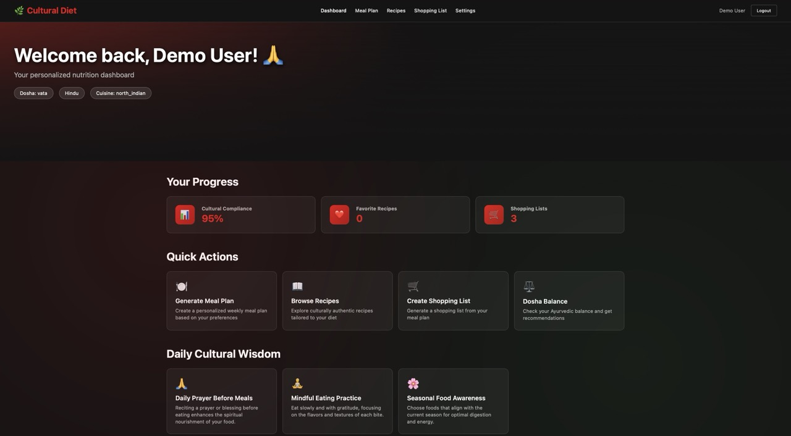
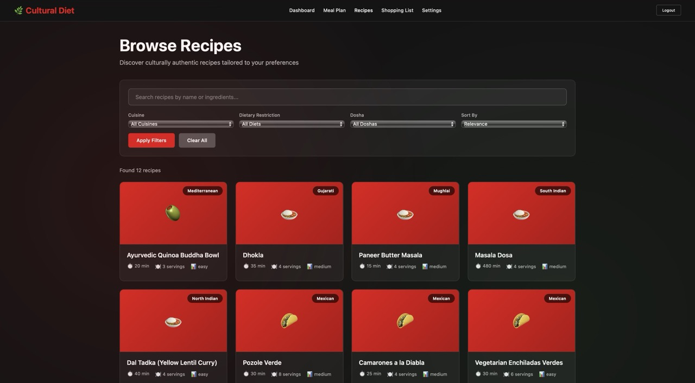

# Cultural Diet Doctor - Culturally-Aware Meal Planning Application

A comprehensive local-first application for managing cultural dietary preferences, Ayurvedic nutrition, and traditional food practices. Generate personalized meal plans, discover culturally authentic recipes, and create retailer-organized shopping lists—all while respecting your dietary restrictions and cultural background.


## 📖 Table of Contents

- [Features](#-features)
- [Screenshots](#-screenshots)
- [Architecture](#-architecture)
- [Getting Started](#-getting-started)
- [API Documentation](#-api-documentation)
- [Cultural Rules Engine](#-cultural-rules-engine)
- [Database Schema](#-database-schema)
- [Security Features](#-security-features)
- [Development](#-development)
- [Documentation](#-documentation)
- [Contributing](#-contributing)
- [License](#-license)

## 🌟 Features

### Core Functionality
- **User Management**: Profile management with cultural and dietary preferences
- **Recipe Database**: Authentic recipes with cultural and Ayurvedic metadata
- **Meal Planning**: Smart meal generation based on cultural rules and preferences
- **Shopping Lists**: Retailer-organized shopping with cultural ingredient mapping
- **Product Catalog**: Multi-retailer product database with cultural classifications
- **Cultural Rules Engine**: Comprehensive validation for dietary and cultural compliance

### Cultural & Dietary Features
- **Hindu Dietary Compliance**: No red meat, traditional food practices
- **Ayurvedic Dosha Support**: Vata, Pitta, Kapha-based meal recommendations
- **Multi-Cultural**: North Indian, South Indian, Mughlai, Gujarati, and international cuisines
- **Retailer Integration**: Patel Brothers, Subzi Mandi, Hanuman, Trader Joe's
- **Dietary Restrictions**: Vegetarian, vegan, medical restrictions, cultural requirements

## 📸 Screenshots

### Dashboard
The main dashboard provides an overview of your current meal plan, recent recipes, and quick actions.


*Dashboard showing weekly meal plan overview, recipe suggestions, and quick navigation*

### Recipe Browser
Discover authentic recipes filtered by cuisine, difficulty, dietary restrictions, and Ayurvedic dosha compatibility.


*Recipe browser with cultural filters and search functionality*

### Recipe Detail View
Detailed recipe view with ingredients, step-by-step cooking instructions, nutritional information, and Ayurvedic guidance.


*Recipe detail page showing Punjabi Tandoori Chicken with complete cooking instructions*

### Meal Plan Generator
Generate personalized 7-day meal plans based on your cultural preferences, dietary restrictions, and Ayurvedic dosha.


*Weekly meal plan with breakfast, lunch, and dinner for 7 days*

### Shopping List
Automatically generate shopping lists from meal plans, organized by retailer and aisle for efficient shopping.


*Shopping list grouped by retailer (Patel Brothers, Trader Joe's, Costco) with aisle organization*

### Settings & Profile
Manage your profile, cuisine preferences, dietary restrictions, Ayurvedic dosha, and account settings.


*User settings page with profile management, preferences, and password change*

---

## 🏗️ Architecture

### Technology Stack
- **Backend**: Node.js + Express + TypeScript
- **Database**: SQLite (local-first operation)
- **Architecture**: Repository pattern with service layer
- **Authentication**: JWT-based with bcrypt password hashing
- **Validation**: Joi schema validation with cultural compliance checking

### Project Structure
```
src/
├── controllers/         # API route handlers
├── repositories/        # Data access layer (Repository pattern)
├── services/           # Business logic (Cultural rules engine)
├── middleware/         # Authentication, validation, error handling
├── utils/              # Validation, auth, error utilities
├── types/              # TypeScript type definitions
├── database/           # Database schema, migration, seeding
└── server.ts           # Main application entry point
```

## 🚀 Getting Started

### Prerequisites
- **Docker**: Docker Desktop (recommended) or Docker Engine + Docker Compose
- **OR Node.js**: Node.js 18+ and npm (for native development)
- Git

### Option 1: Docker deployment (Recommended)

1. **Quick Start**
```bash
git clone <repository-url>
cd cultural-diet-app
./quick-start.sh
```

2. **Or manual Docker setup**
```bash
# Start development environment
./deploy.sh dev up

# Access the application
# Frontend: http://localhost:3001
# Backend API: http://localhost:3000
# Health Check: http://localhost:3000/health
```

3. **Docker documentation**
📖 See [DOCKER_SETUP.md](./DOCKER_SETUP.md) for comprehensive Docker documentation

### Option 2: Native development

1. **Clone and setup**
```bash
git clone <repository-url>
cd diet_doctor
npm install
```

2. **Environment configuration**
```bash
cp .env.example .env
# Edit .env with your configuration
```

3. **Database setup**
```bash
# Run database migration
npm run migrate

# Seed with sample data
npm run seed
```

4. **Start development server**
```bash
npm run dev
```

The server will start on `http://localhost:3000`

### Available Scripts
- `npm run dev` - Development server with auto-reload
- `npm run build` - Build for production
- `npm run start` - Start production server
- `npm run migrate` - Run database migrations
- `npm run seed` - Seed sample data
- `npm run test` - Run tests
- `npm run lint` - Run linting

## 📚 API Documentation

### Quick Reference

**Base URLs:**
- Development: `http://localhost:3000/api/v1`
- Health Check: `http://localhost:3000/health`

**Authentication:**
```
Authorization: Bearer <your-jwt-token>
```

### API Endpoints Overview

| Category | Endpoint | Method | Auth | Description |
|----------|----------|--------|------|-------------|
| **Auth** | `/auth/register` | POST | ❌ | Create new account |
| | `/auth/login` | POST | ❌ | User login |
| | `/auth/refresh` | POST | ✅ | Refresh JWT token |
| **User** | `/users/profile` | GET | ✅ | Get user profile |
| | `/users/profile` | PUT | ✅ | Update profile |
| | `/users/change-password` | POST | ✅ | Change password |
| | `/users/account` | DELETE | ✅ | Delete account |
| **Recipes** | `/recipes` | GET | ✅ | Search recipes |
| | `/recipes/:id` | GET | ✅ | Recipe details |
| | `/recipes` | POST | ✅ | Create recipe |
| | `/recipes/:id/favorite` | POST | ✅ | Add to favorites |
| | `/recipes/:id/rate` | POST | ✅ | Rate recipe |
| **Meal Plans** | `/meal-plans/generate` | POST | ✅ | Generate meal plan |
| | `/meal-plans` | GET | ✅ | Get meal plans |
| | `/meal-plans/:date` | GET | ✅ | Get plan by date |
| | `/meal-plans/stats` | GET | ✅ | Get statistics |
| **Shopping** | `/shopping-lists` | POST | ✅ | Create list |
| | `/shopping-lists/:id` | GET | ✅ | Get list details |
| | `/shopping-lists/:id/items` | POST | ✅ | Add item |
| **Cultural** | `/cultural-rules` | GET | ❌ | Get dietary rules |
| | `/cultural-rules/validate-recipe/:id` | POST | ✅ | Validate recipe |
| | `/cultural-rules/substitutions` | GET | ❌ | Get substitutes |

📖 **Full API Documentation**: See [claudedocs/API.md](claudedocs/API.md) for complete endpoint details, request/response examples, and error codes

## 🧘 Cultural Rules Engine

### Supported Dietary Systems
- **Hindu Dietary Restrictions**: No beef, limited pork, traditional practices
- **Ayurvedic Dosha System**: Vata/Pitta/Kapha balancing recommendations
- **Vegetarian/Vegan**: Plant-based dietary preferences
- **Medical Restrictions**: Gluten-free, lactose-free, allergies
- **Cultural Traditions**: Jain fasting, Sattvic principles

### Validation Features
- Recipe compliance checking with scoring system
- Ingredient validation with substitution suggestions
- Cultural authenticity verification
- Ayurvedic balance analysis

## 🛒 Retailer Integration

### Supported Retailers
- **Patel Brothers**: Indian grocery specialist
- **Subzi Mandi**: Fresh produce and Indian ingredients
- **Hanuman**: Traditional Indian food products
- **Trader Joe's**: Modern alternatives and organic options

### Features
- Price comparison across retailers
- Cultural ingredient mapping
- Shopping list generation by retailer
- Product substitution suggestions

## 📊 Database Schema

### Schema Overview

**Database**: SQLite 3.x (local-first, single-file storage)

**Core Tables:**

| Table | Rows | Purpose | Key Relations |
|-------|------|---------|---------------|
| `users` | 100s | User accounts & preferences | → meal_plans, shopping_lists |
| `recipes` | 1000s | Recipe database | ← favorites, meal_plans |
| `product_catalog` | 10,000s | Multi-retailer products | ← shopping_lists |
| `meal_plans` | 1000s | Daily meal assignments | users ←, recipes → |
| `shopping_lists` | 100s | Shopping list items | users ← |
| `cultural_rules` | 10s | Dietary restrictions | Reference data |
| `user_recipe_favorites` | 1000s | User favorites junction | users ←, recipes ← |
| `meal_plan_history` | 10,000s | Meal history & ratings | users ←, recipes ← |

### Key Relationships
```
users (1) ──→ (N) meal_plans
users (1) ──→ (N) shopping_lists
users (M) ←→ (N) recipes (via favorites)
recipes (1) ──→ (N) meal_plan_items
weekly_meal_plans (1) ──→ (N) meal_plan_items
```

### JSON Field Storage

Several fields use JSON for flexible data structures:
- **users**: `cuisine_preferences`, `dietary_restrictions`
- **recipes**: `ingredients`, `instructions`, `ayurvedic_info`, `nutritional_info`
- **product_catalog**: `cultural_tags`, `dietary_certifications`
- **meal_plans**: meal objects (breakfast/lunch/dinner/snack)

📖 **Complete Schema Documentation**: See [claudedocs/DATABASE.md](claudedocs/DATABASE.md) for detailed table structures, indexes, and relationships

## 🔒 Security Features

- JWT-based authentication with refresh tokens
- Password hashing with bcrypt (12 rounds)
- Input validation with Joi schemas
- CORS configuration for frontend integration
- SQL injection prevention with parameterized queries
- Rate limiting ready (implementation optional)

## 🌍 Cultural Authenticity

### Recipe Standards
- Authentic recipes from cultural sources
- Traditional cooking methods preserved
- Cultural notes and historical context
- Regional cuisine differentiation

### Dietary Compliance
- Religious restriction enforcement
- Cultural practice respect and accuracy
- Traditional ingredient mapping
- Modern adaptation guidelines

## 🧪 Development

### Running Tests
```bash
npm test
```

### Code Quality
```bash
npm run lint          # ESLint checking
npm run typecheck     # TypeScript type checking
```

### Database Management
```bash
npm run migrate       # Run migrations
npm run migrate:down  # Rollback migrations
npm run seed         # Seed sample data
npm run seed:reset   # Reset and reseed
```

## 📈 Performance

### Optimization Features
- SQLite optimization with proper indexing
- Efficient query patterns with repository layer
- Lazy loading for large datasets
- Pagination for resource management
- JSON field optimization for complex data

### Local-First Operation
- Offline capability with local SQLite database
- No external database dependencies
- Fast local operation without network latency
- Simple deployment and scaling

## 🤝 Contributing

### Code Standards
- TypeScript strict mode enforced
- Comprehensive test coverage required
- Cultural accuracy and sensitivity mandatory
- Documentation updates for new features

### Cultural Sensitivity
- Respect for all dietary traditions required
- Accurate representation of cultural practices
- Community consultation for new cultural additions
- Proper attribution for traditional knowledge

## 📚 Documentation

### Complete Documentation Suite

| Document | Description | Link |
|----------|-------------|------|
| **API Documentation** | Complete API endpoint reference with examples | [claudedocs/API.md](claudedocs/API.md) |
| **Architecture Guide** | System architecture, design patterns, data flow | [claudedocs/ARCHITECTURE.md](claudedocs/ARCHITECTURE.md) |
| **Database Schema** | Detailed schema, relationships, performance | [claudedocs/DATABASE.md](claudedocs/DATABASE.md) |
| **README** | Project overview and quick start | This file |

### Quick Links

- 🐛 **Report Issues**: [GitHub Issues](https://github.com/your-org/diet-doctor/issues)
- 💡 **Request Features**: [Feature Requests](https://github.com/your-org/diet-doctor/issues/new)
- 📖 **API Reference**: [claudedocs/API.md](claudedocs/API.md)
- 🏗️ **Architecture**: [claudedocs/ARCHITECTURE.md](claudedocs/ARCHITECTURE.md)

## 🤝 Contributing

### Development Workflow

1. Fork the repository
2. Create feature branch (`git checkout -b feature/amazing-feature`)
3. Commit changes (`git commit -m 'Add amazing feature'`)
4. Push to branch (`git push origin feature/amazing-feature`)
5. Open Pull Request

### Code Standards

- **TypeScript**: Strict mode enforced
- **Testing**: Comprehensive test coverage required
- **Cultural Accuracy**: Mandatory for all recipe and cultural data
- **Documentation**: Update docs for new features

### Cultural Sensitivity Guidelines

- Respect for all dietary traditions required
- Accurate representation of cultural practices
- Community consultation for new cultural additions
- Proper attribution for traditional knowledge

## 🔮 Future Enhancements

### Planned Features

- [ ] **Mobile App**: React Native mobile application
- [ ] **Cloud Sync**: Optional encrypted cloud backup (end-to-end)
- [ ] **Recipe Sharing**: Community recipe sharing with moderation
- [ ] **Nutrition Tracking**: Advanced nutritional analytics
- [ ] **Grocery Delivery**: Integration with online grocery services
- [ ] **Voice Commands**: Voice-controlled recipe instructions
- [ ] **Meal Prep Mode**: Batch cooking and meal prep planning
- [ ] **Family Profiles**: Multiple user profiles per household
- [ ] **Allergen Warnings**: Enhanced allergen detection and warnings
- [ ] **Smart Scaling**: Automatic recipe scaling for serving size

### Technical Roadmap

- [ ] Automated testing suite (Jest + Supertest)
- [ ] Database migration framework
- [ ] Performance monitoring and analytics
- [ ] Electron desktop packaging
- [ ] Docker production optimization
- [ ] CI/CD pipeline setup
- [ ] End-to-end testing with Playwright

## 📄 License

MIT License - See LICENSE file for details

## 🙏 Acknowledgments

- Traditional recipe sources and cultural knowledge keepers
- Ayurvedic practitioners and nutritionists
- Community members providing authentic recipes
- Retail partners for product information
- Open source community for excellent tools and libraries

---

**Built with ❤️ for cultural preservation and dietary freedom**

*For support, questions, or feedback, please [open an issue](https://github.com/your-org/diet-doctor/issues)*
